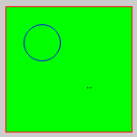

# Drawing

TODO write intro

## Overview

TODO add API docs / include header

## Sketching functions


```c
#include "sketchbook.h"
#include "drawing.h"
#include "misc.h"

void setup() {
  // do initialization here
}

void draw() {
  // this will be repeated on and on and on...
  rectangle(10, 10, 200, 200);
  line(10, 20, 40, 10);
  ellipse(150, 60, 30, 20);
  circle(80, 150, 20);
  pie(60, 50, 30, 30, 180);
  pixel(100, 100);
}
```

## Coloring



```c
#include "sketchbook.h"
#include "drawing.h"
#include "misc.h"

void setup() {
  // do initialization here
}

void draw() {
  stroke(255, 0, 0); // apply stroke for all subsequent shapes
  line(10, 20, 40, 10); // appears red

  fill(0, 255, 0); // apply fill for all following shapes
  rectangle(10, 10, 150, 150); // has a green background and still red stroke

  stroke(0, 0, 255);
  no_fill(); // disable filling
  circle(50, 50, 20); // appears with blue stroke and not no fill

  no_stroke(); // disable stroking
  circle(10, 10, 10); // this is invisible
  
  stroke(0, 0, 0);
  pixel(100, 100); // adds three black pixels
  pixel(102, 100);
  pixel(104, 100);
}
```